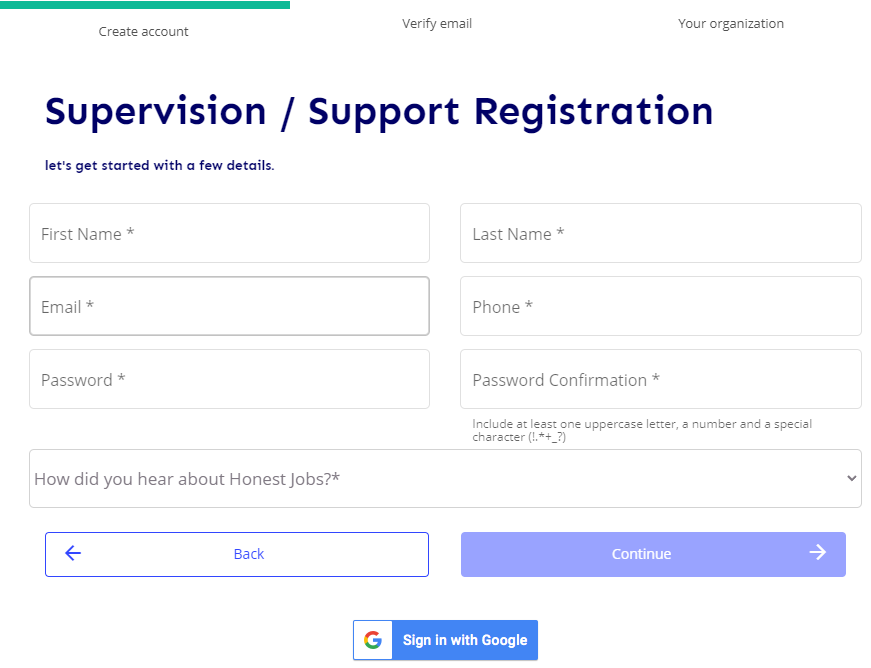
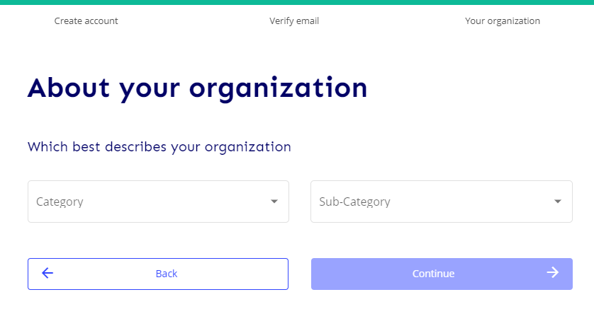
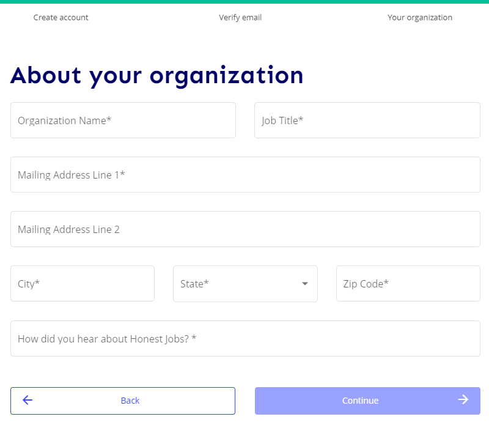

# Fair Chance Partner API v1.1 Documentation

## Overview
The Fair Chance Partner API allows you to build a deep integration for your customers with Honest Jobs, without requiring them to leave your site or app. 

If your site or app interfaces with justice-impacted individuals, you can create job seeker accounts with Honest Jobs, and provide job searches that include our proprietary ConflixAI score. You can even allow those individuals to apply for those jobs!

If your customers are fair-chance employers, you can create employer accounts with Honest Jobs, and allow them to post their open positions to our large network of justice-impacted job seekers.

# Setting up your partner account

Create a new Supervision & Support account in either the [Test](https://test-app.honestjobs.co/) or the [Production](https://app.honestjobs.co/) environment. 

Verify your email address, and complete the registration process.

